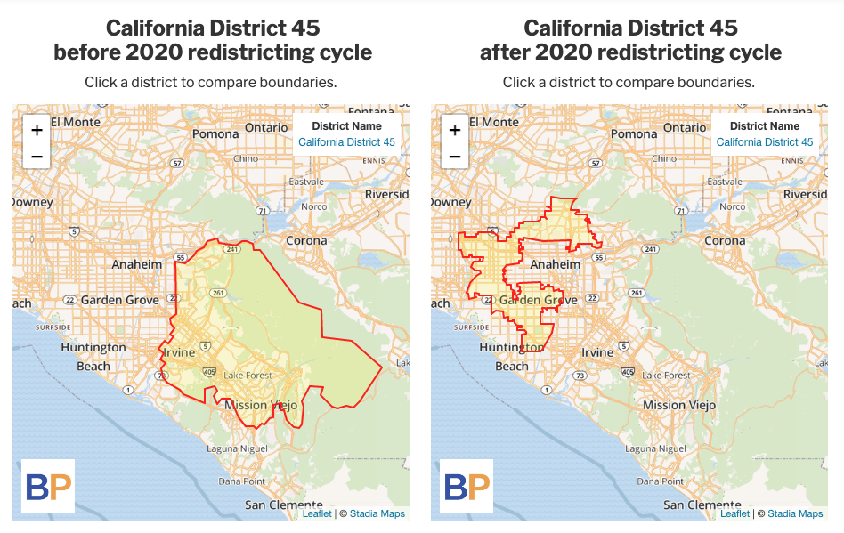
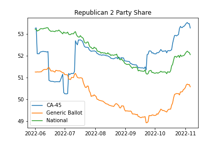

# District Overview
The first important note about 2022's CA-45 is that it is a fundamentally different district than 2020's CA-45. The incumbent 2020 CA-45 representative is now in the CA-47 district, and the Republican nominee for 2022's CA-45 currently represents 2020's CA-48. With that in mind, here are the major differences between the old CA-45, and what the new CA-45 is.

## Geography
From [Ballotpedia](https://ballotpedia.org/California%27s_45th_Congressional_District_election,_2022#District_map): 

The new 45th district represents part of LA County and Orange County in Southern California. The new district is less concave than the 2020 district, due to the intent of the district to better represent Asian Americans, with less focus on geographic simplicity. This district essentially covers large chunks of the suburban Los Angeles.

## Demographics
The demographics of this district are the most important distinction of this district. This district has a much larger representation for Asian-American voters, a subset of voters that carries many divisions along ethnicity and partisan lines.

```{r echo=FALSE, results="hide", message=FALSE, warning=FALSE}
library(ggplot2)
data <- data.frame(
  group=c('White','Latino','Black','Asian'),
  value=c(35.6,23,4.5,36.9)
)

ggplot(data, aes(x="", y=value, fill=group)) +
  geom_bar(stat="identity", width=1, color="white") +
  coord_polar("y", start=0) +
  
  theme_void() +  # remove background, grid, numeric labels
  geom_text(aes(label = value),
            position = position_stack(vjust = 0.5))
```

(data according to the [California Target Book](https://californiatargetbook.com/) courtesy of the [LA Times](https://www.latimes.com/politics/story/2022-10-22/2022-california-midterm-election-guide-district-45-steel-chen))

Notably, the race highlighted the districts diverse demographics with the Republican nominee being a Korean-American immigrant and the Democratic nominee being the child of Taiwanese-American immigrants. Much of the race focused on appeals to Vietnamese-American immigrants based on US Policy towards China.

It is also worth noting that although the Asian-American focus drew much of the attention during the race, nearly two-thirds of the district is non-Asian-American, further highlighting the district's diversity.

Compared to the state as a whole, this district is roughly representative of the white population (35\% for the state vs 35.6\% for the district) and the black population (5\% for the state vs 4.5\% for the district), but overrepresents Asian Americans (15\% for the state vs 35.6\% for the district) and under-represents Latinos (39\% for the state vs 23\% for the district) according to the [2020 Census via the Public Policy Institute of California](https://www.ppic.org/publication/californias-population/#:~:text=No%20race%20or%20ethnic%20group,according%20to%20the%202020%20Census).   

## Candidates
### Republican Candidate (and winner) Michelle Steel
According to her own about page, "U.S. Representative Michelle Steel is a public servant, immigrant, tax-fighter, and one of the first Korean-American women ever to serve in Congress." ([Steel Campaign Website](https://michellesteelca.com/about/)). Importantly, Michelle Steel was an incumbent (of the 2020 48th district which partially overlapped with 2022's 45th), which provides a heavy advantage in most forecasts. She describes herself as having held public office since 2006, and highlights her anti-tax increase agenda. Furthermore, she highlights her immigration from South Korea with her family.

Notably, her primary focus is on fixing the economy, largely using tax cuts, with secondary focuses of breaking partisan gridlock and fixing the healthcare system. She focuses on her local Californian background, and makes no mention of national Republican focuses.

### Democratic Candidate Jay Chen
According to his website, "Jay Chen is a Lieutenant Commander in the U.S. Naval Reserves, trustee for Mt. San Antonio Community College, and a small business owner." ([Chen Campaign Website](https://chenforcongress.com/meet-the-candidate/))

Jay Chen seeks to highlight both his local connections and his global viewpoint. On the local connections side, he brings his ties from having grown up near the district, attending local public schools, and returning to be a small business owner while working on education locally being on the board of a community college and working with the school district to improve its langauge classes.

To emphasize his global viewpoint, he discusses his time in the Naval Reserves working in Korea and the Middle East, studying and working in Asia and Latin America after attending Harvard, and then working for a global consulting firm (Bain, the name of which he notably leaves off his campaign materials.) 

His main campaign focuses are on "fixing a broken Washington" (presumably with more bipartisanship, which he stresses from his military background), making healthcare cheaper, fixing the economy with support to small businesses and addressing supply chain issues, and standing for veteran issues.   

# Forecast vs Final Outcome
[538's final race projection](https://projects.fivethirtyeight.com/2022-election-forecast/house/california/45/) had Michelle Steel at 81\% chance of winning and Jay Chen at a 19\% chance of winning, and a vote share prediction of 53.2\% for the Republicans. The actual result was 52.6\%, meaning 538 had an R+0.6 error in the vote share prediction. Accordingly, this race ran very close to 538's predictions.

Furthermore, Cook Political Report, Inside Election, and Sabato's Crystal Ball all had this race at Lean Republican according to [Ballotpedia](https://ballotpedia.org/California%27s_45th_Congressional_District_election,_2022#General_election_race_ratings). Likewise, these predictions seem to be within the range of results.

To note of these predictions: although 538 prefers to style its model as leading from the polls, it based its prediction for the race off of zero polls for this district. While it does not say which polling information it imputed from other districts using its CANTOR method, we can see that 538's prediction varied as the congressional generic poll changed.



([district](https://github.com/joshua-doolan/GOV1347-Blog-Posts-F22/blob/main/content/post/2022-12-07-12-7-22-district-narrative-ca-45/house_district_toplines_2022.csv), [generic ballot](https://github.com/joshua-doolan/GOV1347-Blog-Posts-F22/blob/main/content/post/2022-12-07-12-7-22-district-narrative-ca-45/generic_ballot_averages.csv), and [national](https://github.com/joshua-doolan/GOV1347-Blog-Posts-F22/blob/main/content/post/2022-12-07-12-7-22-district-narrative-ca-45/house_national_toplines_2022.csv) data from [538](https://projects.fivethirtyeight.com/2022-election-forecast/house/), analyzed in this [notebook](https://github.com/joshua-doolan/GOV1347-Blog-Posts-F22/blob/main/content/post/2022-12-07-12-7-22-district-narrative-ca-45/analyze_dist.ipynb))

What we can see here is that the district seemed to align very closely with national Republican outcomes except for two periods: the first period from June to late July, and the second from the end of September until election day.This seems o indicate that the model recieved distinct polling information from similar districts around that time in June, and again at late September, and in the lack of similar-district polling, the model essentially imputed national trends onto the district. For example, on Sept 18, [a poll in CA 26](https://projects.fivethirtyeight.com/polls/house/2022/california/26/) released had the Democrat up by 5 instead of the prior average of 10, and it appears that in CA 45 the Republican tilt went up following that poll.

# Campaign Narrative
Two large themes from the campaign are the focus on economy / policy and on identity divides.  

## Economy / Policy
With regards to the economy, Michelle Steel made that the primary focus of her campaign, with one clear solution proposed: tax cuts. Michelle highlights this in her background and on her issues page as an area where she has prior accomplishments from her time in local government and from her time in Congress. She lists this as her \#1 accomplishment on her website.

When asked by the Los Angeles Times what her top legislative priority would be, she stated “I will continue to fight to lower taxes on American families. I have long been a taxpayer advocate, and Americans deserve to keep more of their hard-earned dollars. Americans are facing high crime, high prices, and a broken supply chain. I will continue to work on policies that will keep our communities safe, encourage job growth, and increase opportunities for all Americans.” [LA Times](https://www.latimes.com/politics/story/2022-10-20/2022-california-midterm-election-michelle-steel-jay-chen-on-abortion-immigration-inflation).

In comparison, in response to the same question, Jay Chen stated: “The Supreme Court’s decision to overturn Roe will lead to women dying and women going to jail. This is unacceptable. Women deserve the right to govern their own bodies. If elected, one of my first priorities would be to codify Roe. We need to get the cost of prescription drugs and insulin under control. All Americans deserve access to quality affordable health care. I would continue to support the Affordable Insulin Now Act, which caps insulin at $35 per dosage.” [LA Times](https://www.latimes.com/politics/story/2022-10-20/2022-california-midterm-election-michelle-steel-jay-chen-on-abortion-immigration-inflation).

However, on Chen's website, there is no mention of abortion on his about page, instead mentioning health care costs in general. On his issues page, abortion is just one topic of many, along with healthcare, infrastructure, and the economy. With regards to the economy, his fix is perhaps more nuanced, focusing on fixing the supply chain and on domestic manufacturing.

Steel on the other hand, never mentions abortion on her website, but when asked her policy on it, stated her belief that life begins at conception and that abortion should be banned except in cases of rape, incest and to protect the life of the mother. Furthermore, she co-sponsored legislation banning abortion with no exceptions while in the House. These views were not made her focus during the campaign.

## Identity

The second large theme from the campaign was each side potentially seeking to exploit the other's background to poresent them as not-fit for the seat. Michelle Steel sought to link Jay Chen to China, looking to draw a parellel between him and communist ideology. This strategy seems inspired by an attempt to connect with Vietnamese-American voters who skew more conservative and who have a strongly negative view as communism.

On the other hand, Jay Chen was accused of mocking Michelle Steel's accent (stating that it was difficult to understand without an interpreter), a claim which he denies. Instead, Jay Chen argued that this was an attempt by Michelle Steel to misinterpret his comments and draw unjustified national attention to the race.

# Campaign Strategy Analysis v Literature

According to [Vavreck (2009) *The message matters: the economy and presidential campaigns.*](https://muse.jhu.edu/book/36264), the ideal (Presidential) campaing should follow a typology based on economic performance. If the economy helps a candidate (e.g. incumbent party running in a good economy or challenger in bad economy), the candidate should run a "clarifying campaign" focused on the economy. Their opposite party challenger should then run an "insurgent campaign" focusing on issues where public opinion favors their party, with "the more lopsided the distribution of opinion, the better".

Assuming a bad economy in 2022 due to high inflation and therefore lower RDI growth, according to this typology, Michelle Steel should have run a clarifying campaign compared to Jay Chen's insurgent campaign. Based on the prior evidence and themes, it appears that both sides of this campaign followed the typology.

Michelle Steel's economy and tax focused campaign aligns strongly with the correct clarifying campaign. On the other hand, Jay Chen mentioning health care and abortion as his top two issues would be two of the issues where Democrats see the largest divergence in attitudes. Nationally, abortion seems to be an issue where opinions diverge strongly towards Democrats, with pro-choice options winning even in red states, such as Kentucky, with the referendum results at 18 points above the Democratic Senator (according to the AP). Similarly, [according to the Kaiser Family Foundation](https://www.kff.org/health-reform/issue-brief/public-more-likely-to-trust-democratic-party-to-do-a-better-job-dealing-with-most-health-care-issues/), most healthcare issues have a +30 D difference in trust.  

With both campaigns following the typology nearly exactly, it does not surprise that the election results turned out nearly exactly as predicted -- a close race in a slightly Republican leaning district in a slightly Republican favored election year.
