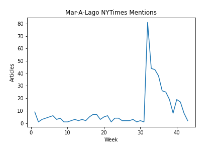

```{r echo=FALSE, results="hide", message=FALSE, warning=FALSE}
library(tidyverse)
train_df = read_csv("train_races_wk6.csv")
train_nonexp_df = train_df %>% filter(is.na(train_df$avg_rating))
train_lm = lm(data=train_nonexp_df, formula=RepVotesMajorPercent ~ dist_turnout + R_inc + D_inc)

train_expert_df = train_df %>% drop_na()
exp_lm = lm(data=train_expert_df, formula=RepVotesMajorPercent ~ dist_turnout + R_inc + D_inc + avg_rating)

test_df = read_csv("test_races_wk6.csv")

test_nonexp_df = test_df %>% filter(is.na(test_df$avg_rating))
test_expert_df = test_df %>% drop_na()

test_nonexp_df["pred"] = predict(train_lm, test_nonexp_df)
test_nonexp_df["lpr"] = predict(train_lm, test_nonexp_df, interval="predict")[1:295, 2]
test_nonexp_df["upr"] = predict(train_lm, test_nonexp_df, interval="predict")[1:295, 3]

test_expert_df["pred"] = predict(exp_lm, test_expert_df)
test_expert_df["lpr"] = predict(exp_lm, test_expert_df, interval="predict")[1:140, 2]
test_expert_df["upr"] = predict(exp_lm, test_expert_df, interval="predict")[1:140, 3]
```

# Model Update

This week for the model, I wanted to incorporate shocks, but inherently, these are non-repeatable events. Instead, I focused on testing the sensititivity of my existing model.

For review, my previous model had two components: a model for predicting competitive races, and a model for predicting non-competitive races. Each model seeks to predict for an individual district the two party vote share for Republicans. Each model carries the same weights/parameters for each district, which is a deliberate modeling choice as opposed to unique parameters for each district, because in 2022, the redistricting inherently causes some issues (for new districts, there is zero data, and for moved districts, such as CA-45, the underlying demographics have fundamentally shifted).

My non-competitive race model simply uses district-level incumbency (binary indicators each for D and R) and turnout.

My competitive race model uses the same data, with expert predictions.

Previously, my model had predicted the following: 

```{r echo=FALSE, message=FALSE, warning=FALSE}
print(paste("Competitive R Seats: ", sum(test_expert_df["pred"] > 50), "/140 = ", mean(test_expert_df["pred"] > 50) * 100, "%", sep=""))
print(paste("Non-Competitive R Seats: ", sum(test_nonexp_df["pred"] > 50), "/295 = ", mean(test_nonexp_df["pred"] > 50) * 100, "%", sep=""))
print(paste("Total R Seats: ", sum(test_expert_df["pred"] > 50) + sum(test_nonexp_df["pred"] > 50), "/435 = ", (sum(test_expert_df["pred"] > 50) + sum(test_nonexp_df["pred"] > 50)) / 435, "%", sep=""))
```

At first, these predictions seem low given the recent polling surge of republicans. However, this data is entirely an incumbency based model, and so it generates an advantage for democrats due to their greater number of incumbents. Importantly, the expert model predicts a greater percentage of Republicans, demonstrating that the additional data brings in some Republican leaning.

To estimate the effect of shocks on my model, I focus on the upper and lower prediction intervals. To do so, for each district, I predict the upper and lower 95\% prediction interval, and then recalculate this seat share. Inherently, this is a very flawed approach, as it assumes a 100\% correlation in the results, whereas in all likelihoof, shocks would appear only in some districts. Nevertheless, we get the following results:

**Democratic Shock: Each District Lower 95\%**

```{r echo=FALSE, message=FALSE, warning=FALSE}
print(paste("Competitive R Seats: ", sum(test_expert_df["lpr"] > 50), "/140 = ", mean(test_expert_df["lpr"] > 50) * 100, "%", sep=""))
print(paste("Non-Competitive R Seats: ", sum(test_nonexp_df["lpr"] > 50), "/295 = ", mean(test_nonexp_df["lpr"] > 50) * 100, "%", sep=""))
print(paste("Total R Seats: ", sum(test_expert_df["lpr"] > 50) + sum(test_nonexp_df["lpr"] > 50), "/435 = ", (sum(test_expert_df["lpr"] > 50) + sum(test_nonexp_df["lpr"] > 50)) / 435, "%", sep=""))
```

**Republican Shock: Each District Upper 95\%**

```{r echo=FALSE, message=FALSE, warning=FALSE}
print(paste("Competitive R Seats: ", sum(test_expert_df["upr"] > 50), "/140 = ", mean(test_expert_df["upr"] > 50) * 100, "%", sep=""))
print(paste("Non-Competitive R Seats: ", sum(test_nonexp_df["upr"] > 50), "/295 = ", mean(test_nonexp_df["upr"] > 50) * 100, "%", sep=""))
print(paste("Total R Seats: ", sum(test_expert_df["upr"] > 50) + sum(test_nonexp_df["upr"] > 50), "/435 = ", (sum(test_expert_df["upr"] > 50) + sum(test_nonexp_df["upr"] > 50)) / 435, "%", sep=""))
```

Notably, we see that the competitive district model has much tighter bounds, and therefore seems more realistically resistant to shocks compared to the non-competitive district model, which assumes complete control on either side. At first, this result may seem non-sensical, as we would expect non-competitive districts to be much more resilient, as they should be further from the tipping point, and competitive models highly variable, as little shifts could push entirely one way or the other. 

However, the reason for our model's performance is that there is a mcuh higher variance in our non-competitive districts, therefore causing the prediction intervals to be wide, and by restricting to competitive races, this variance becomes much smaller, forcing the prediction intervals to fall in much narrower ranges.

# Blog Extension: Mar-A-Lago Raid

One major unexpected event of this election cycle was the FBI's raid on Mar-A-Lago, former President Donald Trump's persoanl residence, in pursuit of missing highly classified documents. This news story captured the attention of both those on the left and the right, as shown in the number of the number of articles that mention "Mar-A-Lago" in the NYTimes spiking during the week of the raid.



However, it should be noted that we can see that the current level of discussion of Mar-A-Lago has now returned to pre-raid levels, seeming to demostrate that the "shock" has already entirely dissapated. Nevertheless, we can analyze the immediate impact of the raid on the generic polling average:


We notice can notice three possible isnights following the raid:

1. In the following week, both D and R support decreased. It is possible that the raid exposed unpopular aspects in each: for Republicans, reinforcing the potentially unlawfulness of their party's leader, and for Democrats, reinforcing the idea that their actions were politically motivated. However, we see that the dip in R support seems to eb larger than the dip in D support.
2. The Democratic support increased in wake of the raid, and the Republican support flatlined. A potential explanation for this is that the raid motivated the democratic base and increased support from their base, but there was no Republican change (because all those who would oppose the party due to Trump had already left).
3. Finally, it's possible that the trend of flipping R and D support that began at approximately week 25 continued through the Mar A Lago raid, subject to regular noise. In this case, the raid did little to change opinions in either party.

Each of these 3 possibilities seems potentially valid based on this (single) data series. Importantly, it shows that the impact of shocks varies widely as you change timeframes of analysism and the degree to which you incprporate other outside information. 

Please note, the plots for these were created in cells 72-74 of the python notebook.